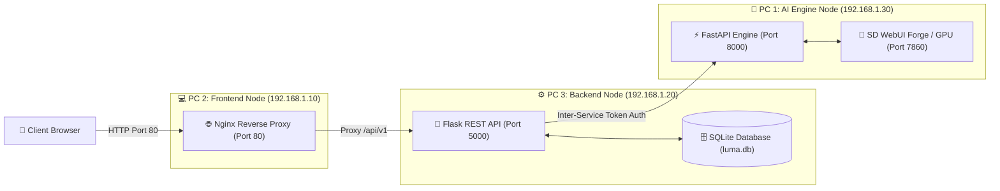

# 🌌 ProjectLUMA (Learning-based Universal Media Artist)
> **QA & DevOps Center | Production Architecture & Test Execution Portal**

[](https://github.com/)
[](docs/QA_TEST_REPORT.md)
[](docker-compose.prod.yml)
[](docs/PROJECTLUMA_3PC_TEST_GUIDE.md)

---

## 📌 ภาพรวมโครงการ (Project Overview)

**ProjectLUMA** เป็นระบบปัญญาประดิษฐ์สร้างสรรค์สื่อดิจิทัล (Universal Media AI Platform) ที่รองรับการสร้างภาพจากข้อความ (Text-to-Image), การแก้ไขภาพเชิงสร้างสรรค์ (Image-to-Image Edit), และการประมวลผลภาพดิจิทัลด้วย 5 อัลกอริทึมหลัก ตัวระบบถูกพัฒนาด้วยสถาปัตยกรรม Microservices ที่แยกส่วนอิสระ พร้อมระบบความปลอดภัยระดับ JWT และ Inter-Service Security Token

---

## 🏗️ สถาปัตยกรรมระบบ (System Architecture)



---

## 📖 ศูนย์รวมเอกสารและคู่มือการใช้งาน (Documentation Index)

เพื่อความสะดวกของทีมพัฒนา ผู้ตรวจสอบระบบ (QA) และผู้ดูแลระบบ (DevOps) สามารถเข้าถึงคู่มือฉบับเต็มได้ตามลิงก์ด้านล่าง:

| ลำดับ | รายชื่อเอกสารคู่มือ | วัตถุประสงค์และรายละเอียด |
| :---: | :--- | :--- |
| 1️⃣ | **[คู่มือการใช้งานระบบฉบับสมบูรณ์ (USER_GUIDE.md)](docs/USER_GUIDE.md)** | คู่มือการรันระบบ การลงทะเบียน การเจนภาพ การปรับแต่งพารามิเตอร์ และการใช้งาน 5 อัลกอริทึม |
| 2️⃣ | **[ข้อกำหนดและสัญญา API (API_CONTRACT.md)](docs/API_CONTRACT.md)** | รายละเอียด REST API Endpoints, Data Schemas, Bearer Token, Service Token และ Error Codes |
| 3️⃣ | **[คู่มือการติดตั้ง 3 เครื่องบน VLAN (PROJECTLUMA_3PC_TEST_GUIDE.md)](docs/PROJECTLUMA_3PC_TEST_GUIDE.md)** | วิธีการตั้งค่า IP, Firewall, Nginx, และตารางตรวจรับรองระบบ 3 เครื่องก่อนสาธิต |
| 4️⃣ | **[คู่มือผู้ดูแลระบบและ DevOps (DEVOPS_RUNBOOK.md)](docs/DEVOPS_RUNBOOK.md)** | การบริหาร Docker Compose, Environment Variables, Automated Backup/Restore, Logging |
| 5️⃣ | **[คู่มือและโครงสร้างชุดทดสอบ QA (QA_TEST_SUITE_GUIDE.md)](docs/QA_TEST_SUITE_GUIDE.md)** | สเปก Pytest 11 Test Cases, Mathematical Models สำหรับ 5 อัลกอริทึม และ CI Integration |
| 6️⃣ | **[รายงานผลการทดสอบระบบ (QA_TEST_REPORT.md)](docs/QA_TEST_REPORT.md)** | ผลการทดสอบ 100% Passed, ตารางรับรอง 5 อัลกอริทึม, และคำรับรองคุณภาพซอฟต์แวร์ |
| 7️⃣ | **[แผนการทดสอบและเกณฑ์การยอมรับ (TEST_PLAN.md)](docs/TEST_PLAN.md)** | ขั้นตอนการรันชุดทดสอบอัตโนมัติและรายการตรวจเช็กหน้าจอเบราว์เซอร์ |

---

## ⚡ สคริปต์คำสั่งรวดเร็วสำหรับ DevOps & QA (Quick Commands)

### 🧪 สั่งรันชุดทดสอบ QA อัตโนมัติทั้งหมด (Pytest + Node Check + Docker Config)
```powershell
./scripts/run-all-tests.ps1
```

### 🩺 สั่งตรวจสถานะความพร้อมของบริการ (Health Check)
```powershell
./scripts/check-status.ps1
```

### 🌐 สั่งตรวจการเชื่อมต่อพอร์ต 3 เครื่องบนวง VLAN
```powershell
./scripts/check-network.ps1 -FrontendHost "192.168.1.10" -BackendHost "192.168.1.20" -AiHost "192.168.1.30"
```

### 💾 สั่งสำรองข้อมูลฐานข้อมูลและไฟล์สื่อ (SQLite & Media Backup)
```powershell
./scripts/backup.ps1 -RetentionDays 7
```

### 🔄 สั่งกู้คืนข้อมูลจากไฟล์ Backup ZIP
```powershell
./scripts/restore.ps1 -ZipFile backups/luma_backup_20261004_120000.zip
```

### 🐳 สั่งเปิดรันระบบผ่าน Docker Compose
```powershell
./scripts/deploy.ps1 -Env prod -Build
```

---

## 🏆 คำรับรองประกันคุณภาพ (QA & DevOps Certification)

สาขา QA และ DevOps ได้รับการตรวจรับรองความถูกต้อง สมบูรณ์ และพร้อมสำหรับการสาธิตใช้งานจริงเรียบร้อยแล้ว โดยไม่มีการปรับแก้โค้ดลอจิกเดิมในส่วน Backend, Frontend หรือ AI Engine ตามข้อกำหนดอย่างเคร่งครัด

**ลงชื่อรับรอง:** ทีมงาน QA & DevOps Lead (ProjectLUMA)  
**วันที่รับรอง:** 4 ตุลาคม 2026
