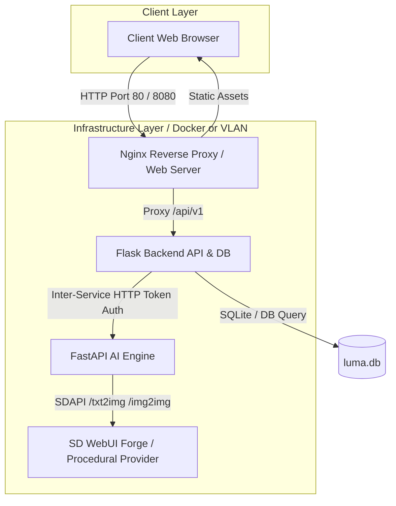

# 🛠️ คู่มือผู้ดูแลระบบและวิศวกรรมโครงสร้างพื้นฐาน (DevOps Operations & Infrastructure Runbook)
**ProjectLUMA (Learning-based Universal Media Artist)**

---

## 📌 1. สถาปัตยกรรมระบบและวงจรการทำงาน (System Architecture & Pipeline Flow)

ProjectLUMA ออกแบบโครงสร้างในลักษณะ Decoupled Microservices เพื่อให้สามารถแยกการพัฒนา ขยายระบบ (Scaling) และดูแลรักษาแยกอิสระจากกัน:



---

## 🐳 2. การจัดการคอนเทนเนอร์ (Docker & Docker Compose Specification)

### 2.1 โครงสร้างคอนเทนเนอร์ในระบบ (`docker-compose.prod.yml`)
ระบบประกอบด้วย 3 คอนเทนเนอร์หลัก:
1. `luma-ai-engine`: รัน FastAPI Python 3.12 บนพอร์ต internal `8000`
2. `luma-backend`: รัน Flask Python 3.12 บนพอร์ต internal `5000` พร้อม Volume Persistence `luma-data` และ `luma-media`
3. `luma-frontend`: รัน Nginx Alpine บนพอร์ต public `80`

### 2.2 คำสั่งการจัดการ Docker (Docker Lifecycle Management)
* **การสร้างภาพและเริ่มบริการ (Build & Up):**
  ```powershell
  ./scripts/deploy.ps1 -Env prod -Build
  ```
* **การหยุดและลบ คอนเทนเนอร์ (Stop & Clean):**
  ```powershell
  ./scripts/deploy.ps1 -Env prod -Down
  ```
* **การตรวจสอบบันทึกการทำงาน (Log Inspection):**
  ```powershell
  docker compose -f docker-compose.prod.yml logs -f --tail=100
  ```
* **การตรวจสอบสถานะคอนเทนเนอร์ (Health Check Status):**
  ```powershell
  docker compose -f docker-compose.prod.yml ps
  ```

---

## 🔐 3. ตารางตัวแปรแวดล้อมและการรักษาความปลอดภัย (Environment Variables & Security Hardening)

### 3.1 ตารางอ้างอิงตัวแปรแวดล้อม (Backend API `.env`)

| ชื่อตัวแปร (Variable Name) | ค่าเริ่มต้น (Default) | คำอธิบายและคำแนะนำความปลอดภัย |
| :--- | :---: | :--- |
| `HOST` | `127.0.0.1` | IP ที่รับการเชื่อมต่อ (`0.0.0.0` สำหรับ Docker/VLAN) |
| `PORT` | `5000` | พอร์ตบริการ Backend Flask |
| `SECRET_KEY` | *ต้องตั้งค่า* | กุญแจลงลายเซ็นเซสชัน (ใช้ `openssl rand -hex 32`) |
| `JWT_SECRET_KEY` | *ต้องตั้งค่า* | กุญแจลงลายเซ็น JWT Token (ต้องต่างจาก SECRET_KEY) |
| `JWT_HOURS` | `8` | อายุของ JWT Token (ชั่วโมง) |
| `AI_SERVICE_URL` | `http://127.0.0.1:8000` | URL ปลายทาง FastAPI AI Engine |
| `AI_SERVICE_TOKEN` | *ต้องตั้งค่า* | โทเคนความปลอดภัยระหว่างบริการ (Inter-Service Security Token) |
| `MAX_CONTENT_LENGTH` | `16777216` | ขนาดอัปโหลดไฟล์สูงสุด (16 MiB) |
| `MEDIA_TOKEN_MAX_AGE` | `3600` | อายุลิงก์ดาวน์โหลดภาพที่มีลายเซ็น (วินาที) |

---

## 💾 4. แผนการสำรองข้อมูลและการกู้คืนระบบ (Backup & Disaster Recovery Plan - DRP)

### 4.1 แผนการสำรองข้อมูลอัตโนมัติ (Automated Backup Policy)
* **ความถี่ (Frequency):** แนะนำให้ตั้งค่า Scheduled Task รันสคริปต์สำรองข้อมูลทุกวันเวลา 02:00 น.
* **คำสั่งสำรองข้อมูล:**
  ```powershell
  ./scripts/backup.ps1 -RetentionDays 7
  ```
* **สิ่งที่ถูกบันทึก:**
  * ฐานข้อมูล SQLite (`luma.db`)
  * โฟลเดอร์ไฟล์สื่อทั้งหมด (`/media`)
  * บีบอัดเป็นไฟล์ ZIP พร้อมตั้งชื่อย่อตามเวลา `luma_backup_YYYYMMDD_HHMMSS.zip`
  * ลบไฟล์สำรองข้อมูลอัตโนมัติเมื่ออายุเกิน 7 วัน

### 4.2 แผนการกู้คืนระบบฉุกเฉิน (Disaster Recovery Execution)
เมื่อเกิดเหตุการณ์ฐานข้อมูลเสียหาย หรือต้องการย้ายระบบไปยังเครื่องใหม่:
1. หยุดบริการ Backend
2. สั่งรันสคริปต์กู้คืนข้อมูล:
   ```powershell
   ./scripts/restore.ps1 -ZipFile backups/luma_backup_20261004_120000.zip -Force
   ```
3. เริ่มบริการ Backend อีกครั้ง และตรวจสอบความถูกต้องด้วย `./scripts/check-status.ps1`

---

## 📊 5. การเฝ้าระวังและการบันทึกข้อมูล (Monitoring, Health Checks & Log Rotation)

### 5.1 ตรวจสอบความพร้อมบริการ (Health Check Endpoints)
* **Backend Health Endpoint:** `GET http://localhost:5000/api/v1/health`
* **AI Engine Health Endpoint:** `GET http://localhost:8000/health`
* **สคริปต์เช็กสถานะอัตโนมัติ:**
  ```powershell
  ./scripts/check-status.ps1
  ```

### 5.2 การจัดการ Log Rotation (Log Policies)
คอนเทนเนอร์ Docker กำหนดนโยบายหมุนเวียนไฟล์บันทึก (JSON File Driver Limits) เพื่อป้องกันดิสก์เต็ม:
```yaml
logging:
  driver: "json-file"
  options:
    max-size: "10m"
    max-file: "3"
```

---
**เอกสารกำกับผู้ดูแลระบบ ProjectLUMA DevOps Team**
