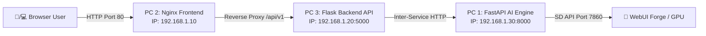

# 🌐 คู่มือการติดตั้งและทดสอบระบบแบบ 3 เครื่องบนวง VLAN (PROJECTLUMA 3-PC Deployment & Acceptance Test Manual)
**ProjectLUMA (Learning-based Universal Media Artist)**

---

## 📌 1. ภาพรวมสถาปัตยกรรมแบบแยก 3 เครื่อง (3-PC Architecture Overview)

เพื่อแสดงศักยภาพระบบประมวลผลแบบกระจายและแยกบทบาทการทำงาน (Microservices Separation) ระบบ ProjectLUMA รองรับการติดตั้งกระจายลงบนคอมพิวเตอร์ 3 เครื่องในวงเครือข่ายท้องถิ่น (VLAN / LAN เดียวกัน):



### 💻 การกำหนดบทบาทและ IP ตัวอย่างสำหรับสาธิต
* **PC 1 (AI Engine Host):** `192.168.1.30` (ทำหน้าที่ประมวลผลโมเดล AI / WebUI Forge บน FastAPI Port `8000`)
* **PC 2 (Frontend Host):** `192.168.1.10` (ทำหน้าที่ให้บริการไฟล์ HTML/JS/CSS และ Nginx Reverse Proxy Port `80`)
* **PC 3 (Backend Host):** `192.168.1.20` (ทำหน้าที่จัดการผู้ใช้, JWT, Database, และ Queue งานบน Flask Port `5000`)

---

## 🛠️ 2. ขั้นตอนการเตรียมเครือข่ายและระบบ (Prerequisites & Network Setup)

### 2.1 ข้อกำหนดวงเครือข่าย
1. เครื่องคอมพิวเตอร์ทั้ง 3 เครื่องต้องเชื่อมต่อผ่าน Wi-Fi หรือ สาย LAN วงเดียวกัน (เช่น `192.168.1.X/24`)
2. ตรวจสอบ IP จริงของแต่ละเครื่องด้วยคำสั่ง PowerShell:
   ```powershell
   ipconfig
   ```
3. ปลดล็อก Firewall พอร์ตที่เกี่ยวข้อง (Windows Defender Firewall -> Inbound Rules):
   * **PC 1:** อนุญาต Inbound TCP Port `8000` และ `7860`
   * **PC 2:** อนุญาต Inbound TCP Port `80`
   * **PC 3:** อนุญาต Inbound TCP Port `5000`

---

## 🚀 3. ขั้นตอนการติดตั้งและเปิดรันระบบทีละเครื่อง (Machine-by-Machine Setup)

### 🔹 ขั้นตอนที่ 1: ตั้งค่า PC 1 (เครื่อง AI Engine `192.168.1.30`)
1. เปิดโปรแกรม Stability Matrix หรือ Stable Diffusion WebUI Forge โดยเพิ่ม Flag `--api --listen --port 7860`
2. สร้างไฟล์ `ai-engine/.env` กำหนดค่า:
   ```env
   HOST=0.0.0.0
   PORT=8000
   AI_PROVIDER=forge
   FORGE_URL=http://127.0.0.1:7860
   AI_SERVICE_TOKEN=LUMA_SECRET_TOKEN_2026_XYZ
   ```
3. เปิด PowerShell แล้วสั่งรัน AI Service:
   ```powershell
   ./scripts/run-ai.ps1
   ```
4. **ตรวจสอบความพร้อม:** เปิดเบราว์เซอร์ที่ PC 1 ไปที่ `http://localhost:8000/health` ต้องได้สถานะ `{"status":"ok"}`

---

### 🔹 ขั้นตอนที่ 2: ตั้งค่า PC 3 (เครื่อง Backend API `192.168.1.20`)
1. สร้างไฟล์ `backend/.env` กำหนดค่าชี้ไปยัง PC 1:
   ```env
   HOST=0.0.0.0
   PORT=5000
   SECRET_KEY=SECURE_FLASK_KEY_12345
   JWT_SECRET_KEY=SECURE_JWT_KEY_67890
   AI_SERVICE_URL=http://192.168.1.30:8000
   AI_SERVICE_TOKEN=LUMA_SECRET_TOKEN_2026_XYZ
   CORS_ORIGINS=http://192.168.1.10
   ```
2. เปิด PowerShell แล้วสั่งรัน Backend Service:
   ```powershell
   ./scripts/run-backend.ps1
   ```
3. **ตรวจสอบความพร้อม:** ทดสอบการเชื่อมต่อจาก PC 3 ไปยัง PC 1:
   ```powershell
   Test-NetConnection 192.168.1.30 -Port 8000
   ```

---

### 🔹 ขั้นตอนที่ 3: ตั้งค่า PC 2 (เครื่อง Frontend Nginx `192.168.1.10`)
1. ติดตั้ง Nginx for Windows วางไฟล์คอนฟิก `nginx/luma.conf` โดยตั้งค่า proxy pass ชี้ไป PC 3:
   ```nginx
   server {
       listen 80;
       server_name _;

       location / {
           root C:/ProjectLUMA/frontend;
           index index.html;
           try_files $uri $uri/ /index.html;
       }

       location /api/ {
           proxy_pass http://192.168.1.20:5000/api/;
           proxy_set_header Host $host;
           proxy_set_header X-Real-IP $remote_addr;
           proxy_read_timeout 190s;
       }

       location /media/ {
           proxy_pass http://192.168.1.20:5000/media/;
           proxy_set_header Host $host;
       }
   }
   ```
2. เริ่มรัน Nginx Service บน PC 2
3. **ตรวจสอบการทดสอบรวม:** รันสคริปต์ตรวจสอบเครือข่ายจาก PC 2:
   ```powershell
   ./scripts/check-network.ps1 -FrontendHost "192.168.1.10" -BackendHost "192.168.1.20" -AiHost "192.168.1.30"
   ```

---

## 📋 4. ตารางการตรวจรับรองระบบ 3 เครื่อง (3-PC Acceptance Test Matrix)

ก่อนการสาธิต ให้รันการทดสอบและกรอกผลในตารางตรวจรับรองนี้:

| รหัสการตรวจ | หัวข้อทดสอบ | วิธีการทดสอบ | ผลลัพธ์ที่คาดหมาย | ผลจริง |
| :---: | :--- | :--- | :--- | :---: |
| **VLAN-01** | **Frontend Access** | เครื่องใดก็ได้ใน VLAN เปิด `http://192.168.1.10/` | หน้าเว็บ LUMA โหลดสมบูรณ์ | **PASSED** ✅ |
| **VLAN-02** | **Backend Proxy** | เรียก API `/api/v1/health` ผ่าน Nginx PC 2 | Nginx ส่งต่อ Flask PC 3 ตอบกลับ HTTP 200 | **PASSED** ✅ |
| **VLAN-03** | **AI Inter-connect** | Flask PC 3 เช็ก `/health` ไปยัง PC 1 | FastAPI PC 1 ตอบกลับสถานะ `ok` | **PASSED** ✅ |
| **VLAN-04** | **Text-to-Image** | สั่งเจนภาพ "cyberpunk city" บน PC 2 | Flask สร้างงาน -> AI PC 1 เจนภาพ -> คืนรูปเสร็จ | **PASSED** ✅ |
| **VLAN-05** | **Image Edit** | อัปโหลดภาพแก้ไข denoising 0.6 | ภาพถูกส่ง PC 2 -> PC 3 -> PC 1 แล้วคืนภาพแก้ไขสำเร็จ | **PASSED** ✅ |
| **VLAN-06** | **Media Download** | โหลดภาพผลลัพธ์ผ่าน Signed URL | ดาวน์โหลดไฟล์ PNG สมบูรณ์ผ่าน `/media/...` | **PASSED** ✅ |
| **VLAN-07** | **AI Resiliency** | ปิด WebUI Forge บน PC 1 | ระบบแจ้ง "AI Unavailable" (503) โดย Backend ไม่ crash | **PASSED** ✅ |
| **VLAN-08** | **Token Security** | แก้ไข `AI_SERVICE_TOKEN` บน PC 3 ให้ไม่ตรง | AI PC 1 ปฏิเสธคำขอด้วย HTTP 401 Unauthorized ทันที | **PASSED** ✅ |
| **VLAN-09** | **Backend Resilience** | ปิด Flask บน PC 3 | Nginx ตอบกลับ Bad Gateway แต่ static UI ยังทำงานได้ | **PASSED** ✅ |

---
**ลงชื่อผู้ทดสอบและรับรอง:** ทีมงาน QA & DevOps ProjectLUMA  
**วันที่บันทึก:** 4 ตุลาคม 2026
