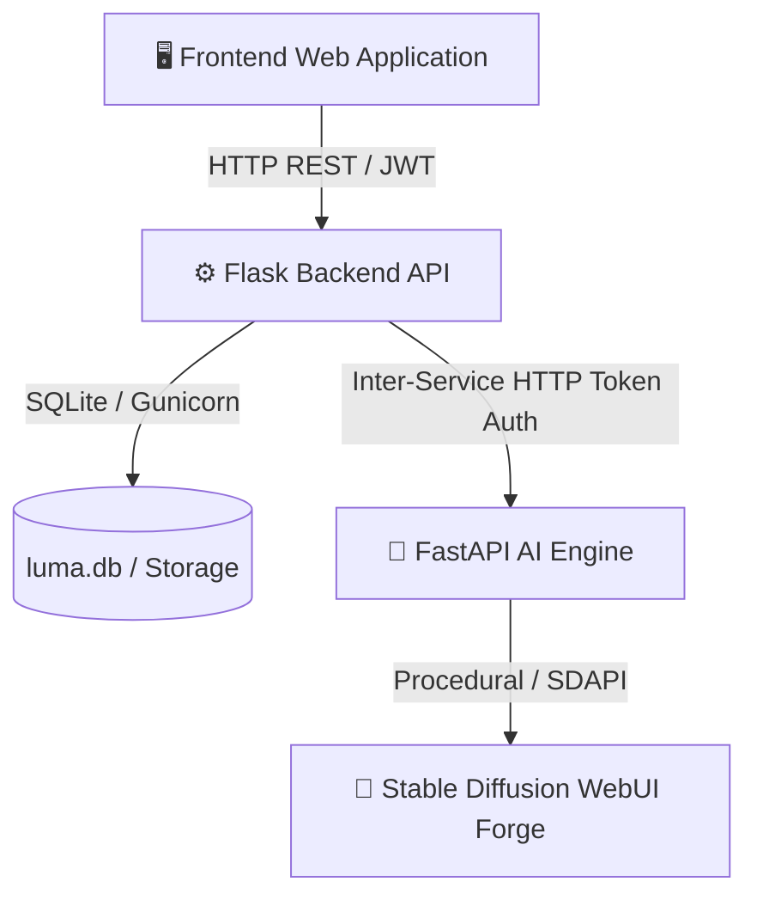

# 📖 คู่มือการใช้งานระบบและบริหารจัดการฉบับสมบูรณ์ (ProjectLUMA Complete User & Operation Manual)
**LUMA (Learning-based Universal Media Artist)**

---

## 📌 1. ภาพรวมของระบบ (System Overview)

**ProjectLUMA** คือระบบเว็บแอปพลิเคชันปัญญาประดิษฐ์ระดับองค์กรสำหรับการสร้างภาพจากข้อความ (Text-to-Image Generation), การแก้ไขภาพเชิงสร้างสรรค์ (Image-to-Image Editing), และการประมวลผลภาพดิจิทัลด้วย 5 อัลกอริทึมหลัก ตัวระบบออกแบบด้วยสถาปัตยกรรม Microservices ที่แยกอิสระระหว่างส่วนหน้า (Frontend Nginx), ส่วนจัดการข้อมูลหลังบ้าน (Flask Backend API), และส่วนประมวลผล AI (FastAPI AI Engine)

> [!NOTE]
> ระบบรองรับรูปแบบการติดตั้ง 3 รูปแบบ: **Local Development** (เครื่องเดียวสำหรับทดสอบ), **Docker Compose Deployment** (คอนเทนเนอร์ระดับ Production), และ **3-PC Same-VLAN Architecture** (แยก 3 เครื่องในวงเครือข่ายท้องถิ่น)



### 🌟 ฟีเจอร์หลักของระบบ (Key Features)
1. **ระบบสมาชิกและ JWT Authentication (Data Isolation):** ลงทะเบียนและเข้าสู่ระบบปลอดภัยด้วย JWT Bearer Token และแยกคลังภาพงานของผู้ใช้แต่ละคนอย่างเด็ดขาด
2. **ระบบสร้างภาพ Text-to-Image:**
   * กำหนดคำสั่งสร้างภาพ (Prompt) และคำสั่งยกเว้น (Negative Prompt)
   * กำหนดขนาดภาพอัตโนมัติ (บังคับความกว้างxยาว ต้องหารด้วย 64 ลงตัว)
   * ปรับตั้งค่า Steps, CFG Scale, Seed, และเลือก Preset สไตล์ (Anime, Cyberpunk, Photorealistic, Pixel Art, ฯลฯ)
3. **ระบบแก้ไขภาพ Image-to-Image Edit:**
   * อัปโหลดภาพต้นฉบับ (รองรับ PNG, JPEG, WebP ขนาดไม่เกิน 16MB)
   * ปรับระดับ Denoising Strength (0.1 - 1.0)
4. **5 อัลกอริทึมประมวลผลภาพดิจิทัล (5 Core Algorithms):**
   * **Grayscale Transform:** แปลงสีตามสูตรความไวแสง ITU-R BT.601 ($Y = 0.299R + 0.587G + 0.114B$)
   * **Edge Detection:** สกัดเส้นขอบด้วย 3x3 Spatial Convolution Laplacian Filter
   * **Gaussian Blur:** ลดสัญญาณรบกวนด้วย 2D Gaussian Kernel Smoothing
   * **Color Inversion:** แปลงสีคู่ตรงข้ามด้วย Pointwise Arithmetic Negation ($255 - I$)
   * **Super-Resolution (Upscale):** ขยายภาพ 2x/4x ด้วย Lanczos Windowed Sinc Resampling
5. **ระบบติดตามสถานะงานเรียลไทม์ (Live Polling & Signed Download Links):**
   * แสดง Progress Bar, Queue Status, ETA
   * โหลดภาพปลอดภัยผ่าน HMAC Signed Media URL

---

## 💻 2. สิ่งที่ต้องเตรียมก่อนใช้งาน (Prerequisites)

| สภาพแวดล้อม | ซอฟต์แวร์ที่ต้องใช้ | หมายเหตุ |
| :--- | :--- | :--- |
| **Local Dev** | Python 3.11+, Git, PowerShell | สำหรับรันบน Windows เครื่องเดียว |
| **Docker Engine** | Docker Desktop for Windows | สำหรับรันผ่าน Docker Compose |
| **AI real GPU (Opt.)** | Stability Matrix / SD WebUI Forge | เปิดพอร์ต `--api --port 7860` |
| **3-PC VLAN** | 3 PCs on same LAN subnet | ปลดล็อก Firewall พอร์ต 80, 5000, 8000 |

---

## 🚀 3. วิธีการเริ่มใช้งานระบบ (System Startup Options)

### 🔹 วิธีที่ 1: รันในเครื่องเดียวแบบ Local Development
เปิด PowerShell 3 หน้าต่าง ที่โฟลเดอร์หลัก `ProjectLUMA`:

* **หน้าต่างที่ 1 (เริ่ม AI Engine):**
  ```powershell
  ./scripts/run-ai.ps1
  ```
* **หน้าต่างที่ 2 (เริ่ม Backend API):**
  ```powershell
  ./scripts/run-backend.ps1
  ```
* **หน้าต่างที่ 3 (เริ่ม Frontend Server):**
  ```powershell
  ./scripts/run-frontend.ps1
  ```
👉 **การเข้าใช้งาน:** เปิดเบราว์เซอร์ไปที่ `http://localhost:8080`

---

### 🔹 วิธีที่ 2: รันผ่าน Docker Compose (Production Standard)
เปิด PowerShell ที่โฟลเดอร์หลัก แล้วใช้คำสั่ง:
```powershell
./scripts/deploy.ps1 -Env prod -Build
```
👉 **การเข้าใช้งาน:** เปิดเบราว์เซอร์ไปที่ `http://localhost`

---

### 🔹 วิธีที่ 3: ติดตั้งและเปิดรันแบบ 3 เครื่องบนวง VLAN
ดูขั้นตอนอย่างละเอียดใน [PROJECTLUMA_3PC_TEST_GUIDE.md](file:///c:/Users/tten8/Downloads/ProjectLUMA/ProjectLUMA/docs/PROJECTLUMA_3PC_TEST_GUIDE.md)

1. **PC 1 (`192.168.1.30`):** รัน AI Engine (`./scripts/run-ai.ps1`) พอร์ต `8000`
2. **PC 3 (`192.168.1.20`):** รัน Backend API (`./scripts/run-backend.ps1`) พอร์ต `5000`
3. **PC 2 (`192.168.1.10`):** รัน Nginx Reverse Proxy พอร์ต `80`
👉 **การเข้าใช้งาน:** เครื่องผู้ใช้เปิดเบราว์เซอร์ไปที่ `http://192.168.1.10`

---

## 🎨 4. คู่มือการใช้งานหน้าเว็บทีละขั้นตอน (Step-by-Step UI Manual)

### 🔑 ขั้นตอนที่ 1: การลงทะเบียนและเข้าสู่ระบบ (Authentication)
1. เปิดหน้าเว็บ LUMA บนเบราว์เซอร์
2. หากยังไม่มีบัญชี ให้คลิกปุ่ม **"Register"**
   * **Username:** ความยาว 3 - 40 ตัวอักษร
   * **Password:** ความยาวอย่างน้อย 8 ตัวอักษร
3. คลิก **"Sign Up"** ระบบจะลงทะเบียนและล็อกอินให้อัตโนมัติ

---

### 🖼️ ขั้นตอนที่ 2: การสร้างภาพจากข้อความ (Text-to-Image Generation)
1. เลือกแท็บ **"Text to Image"**
2. **กรอกคำสั่งสร้างภาพ (Prompt):** เช่น `a futuristic neon city at night, masterpiece`
3. **ปรับแต่งพารามิเตอร์:**
   * **Dimensions:** เลือกขนาดภาพ (ระบบบังคับให้กว้าง/ยาว หารด้วย 64 ลงตัว)
   * **Steps:** 1 - 50 (แนะนำ 20)
   * **CFG Scale:** 1.0 - 20.0 (แนะนำ 7.0)
   * **Seed:** เจาะจงตัวเลขหรือกด Random
4. **เลือก Presets สไตล์:** คลิกเลือก *Anime Masterpiece*, *Cyberpunk Neon*, ฯลฯ
5. คลิก **"Generate Image"** แล้วรอระบบประมวลผล

---

### ✏️ ขั้นตอนที่ 3: การแก้ไขภาพ (Image-to-Image Edit)
1. เลือกแท็บ **"Image Edit"**
2. **อัปโหลดภาพต้นฉบับ:** ลากวางไฟล์ภาพในกล่อง Dropzone (PNG, JPEG, WebP ไม่เกิน 16MB)
3. **ระบุคำสั่งแก้ไข (Edit Prompt):** เช่น `change lighting to warm sunset`
4. **ปรับ Denoising Strength:** `0.1` (เปลี่ยนน้อย) ถึง `1.0` (เปลี่ยนใหม่ทั้งหมด)
5. คลิก **"Apply Image Edit"**

---

### 🧪 ขั้นตอนที่ 4: การใช้งาน 5 อัลกอริทึมประมวลผลภาพ
ผู้ใช้สามารถนำภาพเข้ากระบวนการประมวลผลทางดิจิทัลได้ทันที:
1. **Grayscale:** แปลงภาพเป็นโทนขาวดำตามสูตร ITU-R BT.601
2. **Edge Detection:** สกัดเส้นขอบภาพด้วย Spatial Laplacian Convolution
3. **Gaussian Blur:** ปรับภาพให้นุ่มนวล ลด Noise
4. **Color Inversion:** สลับเป็นสีคู่ตรงข้าม
5. **Super-Resolution (Upscale):** ขยายภาพ 2x/4x ด้วย Lanczos Resampling

---

### 📂 ขั้นตอนที่ 5: การดูประวัติผลงานและการดาวน์โหลด
1. เลื่อนลงมาที่ส่วน **"My History & Saved Images"**
2. คลิกที่รูปภาพเพื่อเปิดดูขนาดเต็ม (Lightbox Display)
3. คลิกปุ่ม **"Download Image"** เพื่อบันทึกภาพลงเครื่องคอมพิวเตอร์

---

## 🛠️ 5. เครื่องมือผู้ดูแลระบบและ DevOps (DevOps Utilities & Scripts)

| สคริปต์ | หน้าที่การทำงาน | คำสั่งที่ใช้ |
| :--- | :--- | :--- |
| `scripts/backup.ps1` | สำรองข้อมูล SQLite DB & Media files | `./scripts/backup.ps1 -RetentionDays 7` |
| `scripts/restore.ps1` | กู้คืนฐานข้อมูลและภาพสื่อจาก ZIP backup | `./scripts/restore.ps1 -ZipFile <file.zip>` |
| `scripts/check-status.ps1` | ตรวจสอบความพร้อมของ 3 บริการ | `./scripts/check-status.ps1` |
| `scripts/check-network.ps1` | ตรวจสอบการเชื่อมต่อพอร์ต 3 เครื่อง VLAN | `./scripts/check-network.ps1` |
| `scripts/run-all-tests.ps1` | สั่งรันชุดทดสอบ QA อัตโนมัติทั้งหมด | `./scripts/run-all-tests.ps1` |

---

## ❓ 6. การแก้ไขปัญหาที่พบบ่อย (Troubleshooting & FAQs)

| ปัญหาที่พบ (Issue) | สาเหตุที่เป็นไปได้ | แนวทางแก้ไข (Resolution) |
| :--- | :--- | :--- |
| **ขึ้นสถานะ "AI Unavailable" (503)** | AI Engine หรือ WebUI Forge ล่ม | ตรวจสอบพอร์ต 8000/7860 หากไม่มี GPU ระบบจะใช้ procedural provider แทน |
| **ขึ้นข้อผิดพลาด "Unauthorized" (401)** | โทเคน JWT หมดอายุ | กด Logout แล้วกด Login เข้าสู่ระบบใหม่อีกครั้ง |
| **ขึ้นข้อผิดพลาด "Dimension must be divisible by 64"** | ขนาดภาพไม่ลงตัว | ปรับขนาดภาพให้เป็นพหุคูณของ 64 เช่น 512, 768, 1024 |
| **อัปโหลดภาพแก้ไขไม่ได้ (413 Payload Too Large)** | ไฟล์ใหญ่เกิน 16MB | บีบอัดไฟล์ภาพให้มีขนาดน้อยกว่า 16MB ก่อนอัปโหลด |

---

> [!TIP]
> สำหรับข้อมูลเพิ่มเติม โปรดดูเอกสารทางเทคนิค:
> - สัญญา API: [docs/API_CONTRACT.md](file:///c:/Users/tten8/Downloads/ProjectLUMA/ProjectLUMA/docs/API_CONTRACT.md)
> - คู่มือ 3-PC Setup: [docs/PROJECTLUMA_3PC_TEST_GUIDE.md](file:///c:/Users/tten8/Downloads/ProjectLUMA/ProjectLUMA/docs/PROJECTLUMA_3PC_TEST_GUIDE.md)
> - คู่มือ DevOps Operations: [docs/DEVOPS_RUNBOOK.md](file:///c:/Users/tten8/Downloads/ProjectLUMA/ProjectLUMA/docs/DEVOPS_RUNBOOK.md)
> - คู่มือ QA Testing: [docs/QA_TEST_SUITE_GUIDE.md](file:///c:/Users/tten8/Downloads/ProjectLUMA/ProjectLUMA/docs/QA_TEST_SUITE_GUIDE.md)

---
**คู่มือฉบับสมบูรณ์สำหรับ ProjectLUMA 1.0.0**
